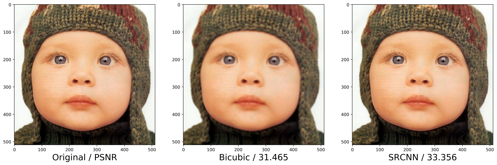
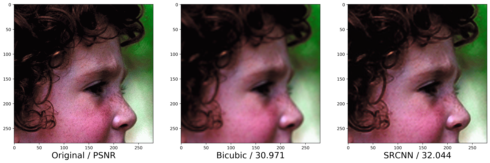
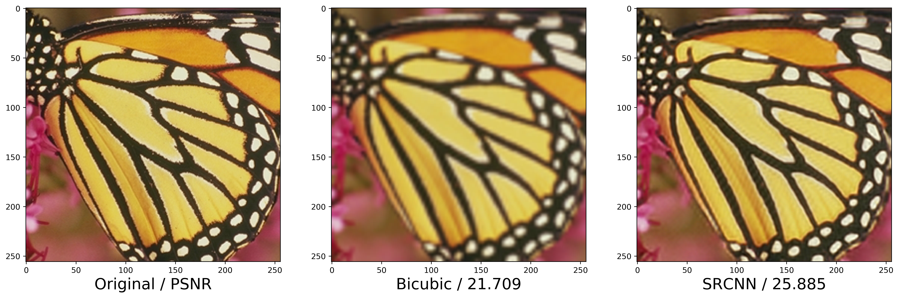
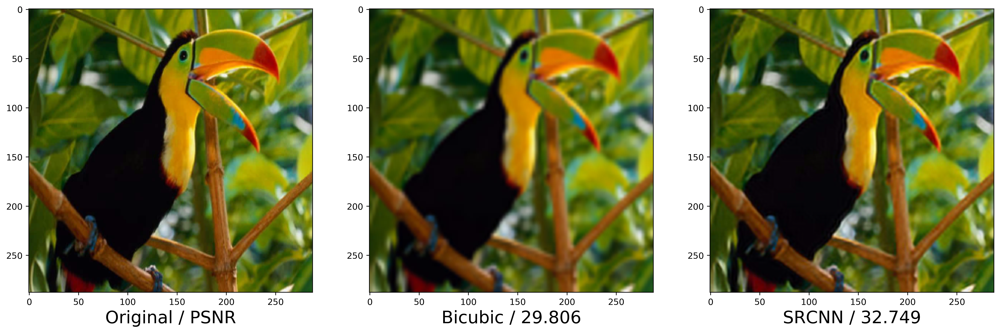
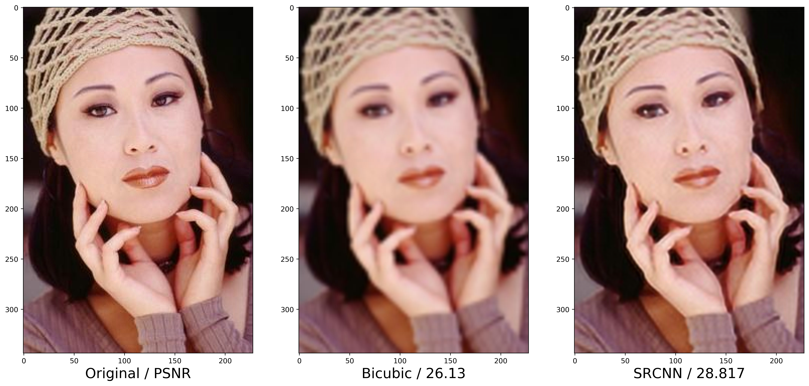

# SRCNN

This is me reproduction of the model and results in the paper

**[Image Super-Resolution Using Deep Convolutional Networks](https://ieeexplore.ieee.org/abstract/document/7115171)**
<br>
Chao Dong
Chen Loy
et al.
<br>
Published in 2017 IEEE transactions on pattern analysis and machine intelligence


This repository includes an implementation of SRCNN and model trained for 3x super resolution.
The included model was trained on the BSDS500 training and validation sets. The BSDS500 test set
was used as a validation set. As a test set I use the popular Set5 images, which were also used
in the original paper to demonstrate their results. You can see these results here:








## Contents
This repository provides:
- A [trained SRCNN] for 3x super-resolution (models/)
- [Code to generate] the training and validation sets (src/data/build_sr_dataset.py)
- The [notebook used to train the model] from scratch (notebooks/SR_with_MSE_loss.ipynb)
- A [notebook] to visualize the first conv. layer kernels (src/visualization/visualize_kernels.ipynb)
- A [notebook] to generate demo images (src/visualization/generate_images.ipynb)

## Differences from the paper
- The paper says that they trained their models for 8x10^8 back-propagations.
This seems unreasonably long and I suspect that it was a typo. I trained for 15x10^6 and achieved good results.
- The paper says they used no padding while training to avoid boarder effects. I didn't find evidence of this
problem in my images, so I pad to preserve the input image's dimensions.

## Setup
All code is implemented in Python and Pytorch.

First install the project dependencies:

```bash
pip install -r requirements.txt
```

Then download a dataset and move it to [data/raw/] (data/raw)

Build the training and validation datasets as follows:

```bash
python3 src/data/build_sr_dataset.py <path_to_train_images/> <data/train/file_name.hdf5> <super_resolution_factor>

python3 src/data/build_sr_dataset.py <path_to_val_images/> <data/val/file_name.hdf5> <super_resolution_factor>
```

Train the model by running the [training notebook] (notebooks/SR_with_MSE_loss.ipynb)

## Watch Learning Progression

Start TensorBoard on localhost:8898 after training has started
